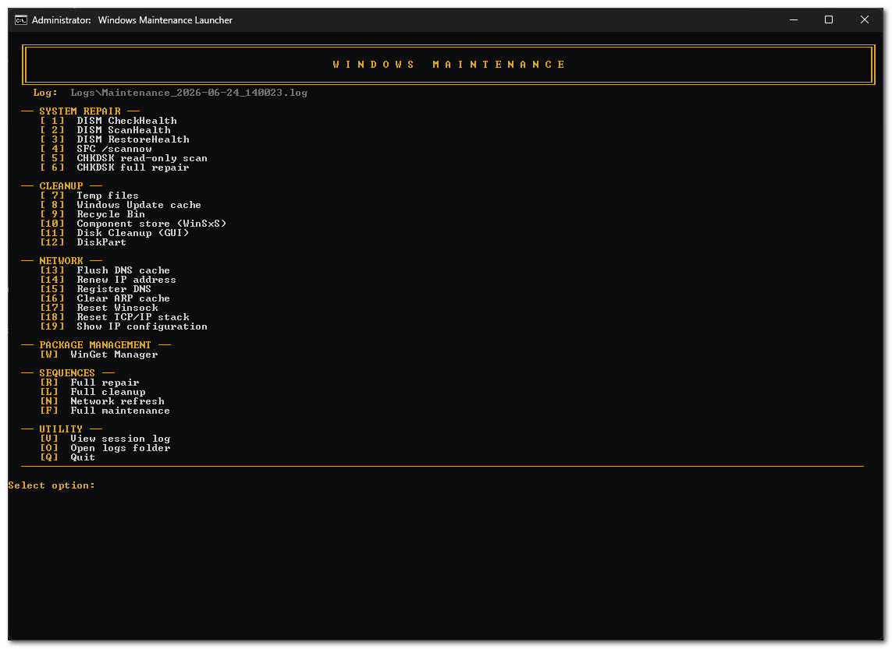
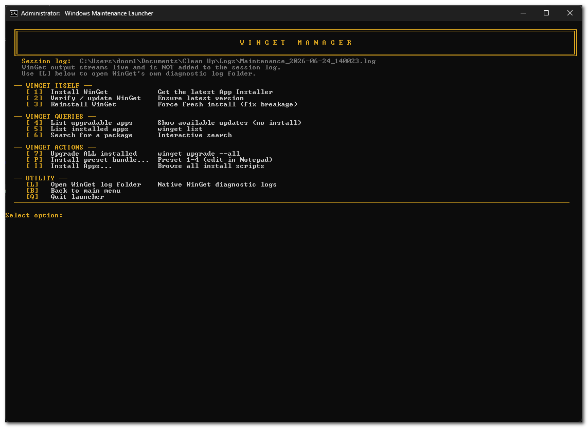
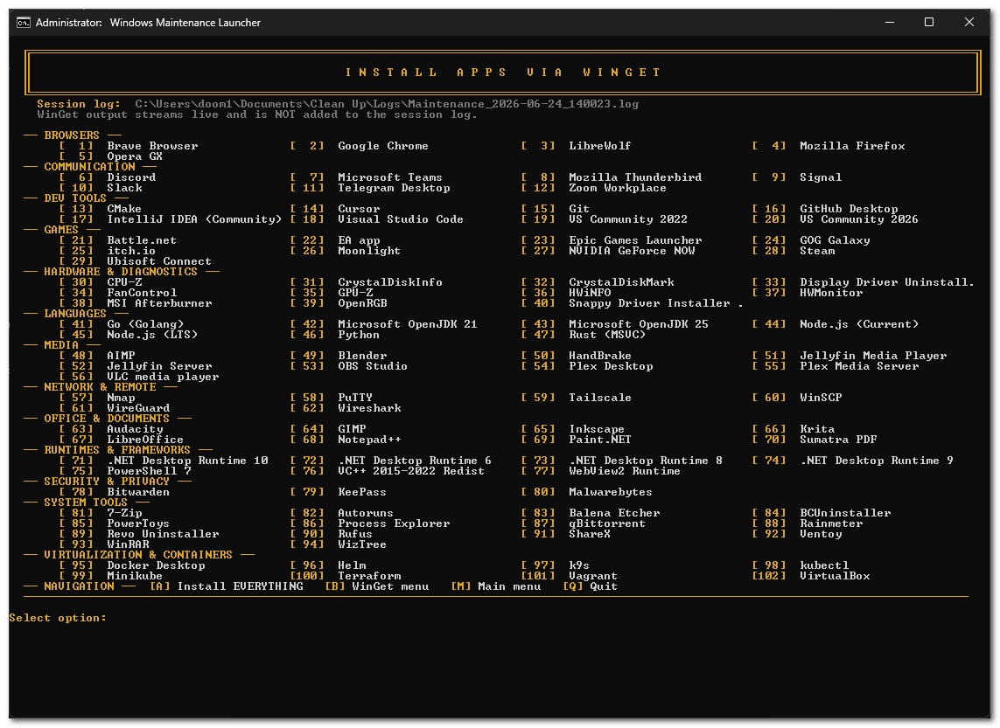
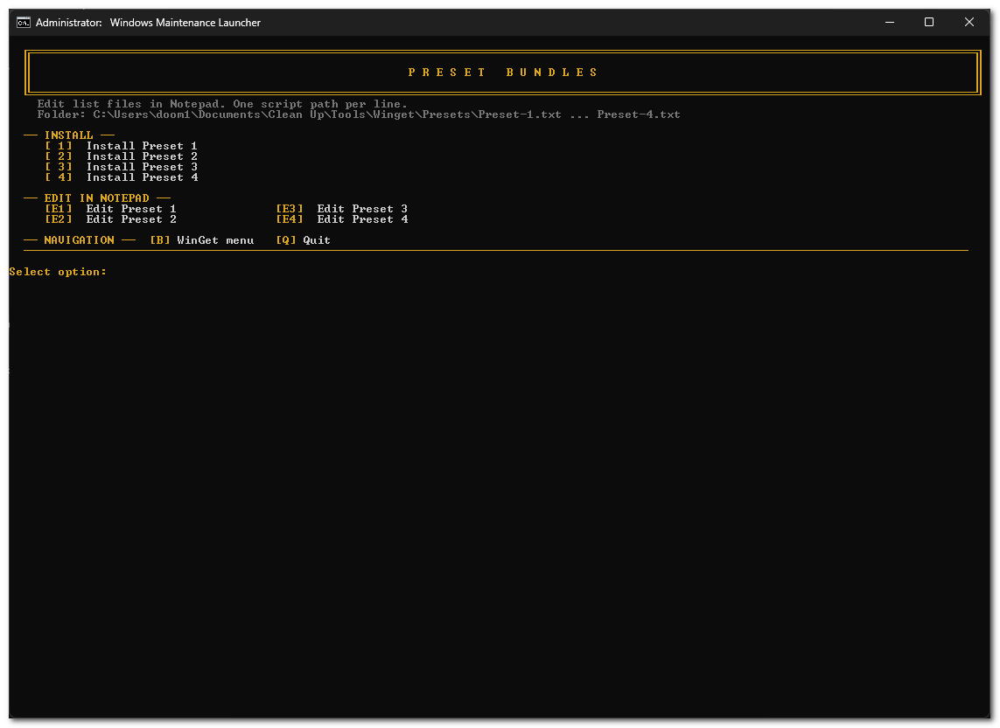

# Windows Maintenance Toolkit

A menu-driven Windows maintenance and software deployment utility for technicians, power users, and anyone who routinely sets up or services PCs. The toolkit consolidates system repair, disk operations, cleanup, network diagnostics, and WinGet-based application management into a single elevated launcher with full session logging.

## Overview

**Windows Maintenance Toolkit** is built around one entry point: `MaintenanceLauncher.bat`. From the main menu you can run individual maintenance tasks, execute predefined multi-step sequences, or open the integrated WinGet manager to install and update third-party software. All maintenance tool output is captured in timestamped session logs under `Logs\`.

The project is designed for practical bench work: clear menus, administrator elevation handled once per session, and scripts organized by function under `Tools\`.

## Key Features

| Area | Capabilities |
|------|----------------|
| **System repair** | DISM (CheckHealth, ScanHealth, RestoreHealth) and SFC `/scannow` |
| **Disk operations** | CHKDSK (online scan and scheduled full repair), Disk Cleanup GUI, interactive DiskPart with guide |
| **Cleanup** | Temp files, Windows Update cache, Recycle Bin, WinSxS component store cleanup |
| **Network** | DNS flush/renew/register, ARP cache clear, Winsock and TCP/IP stack reset, IP configuration display |
| **Sequences** | One-key repair, cleanup, network refresh, and full maintenance chains |
| **WinGet manager** | Install or repair WinGet, list/search/upgrade packages, browse 102 curated install scripts |
| **Preset bundles** | Four editable text-based presets for batch software deployment |
| **Logging** | Per-session maintenance log with computer name, user, and timestamps |

## Requirements

- **Operating system:** Windows 10 (1809 or later) or Windows 11
- **Privileges:** Administrator rights (the launcher requests elevation automatically)
- **WinGet:** Required for package management features; the launcher can install or update WinGet if it is missing
- **PowerShell:** Used internally for logging, console sizing, and WinGet installation

## Quick Start

1. Clone or download this repository to a local folder.
2. Right-click **`MaintenanceLauncher.bat`** and select **Run as administrator**, or double-click it and approve the UAC prompt.
3. Choose a numbered option from the main menu, or press **`W`** to open the WinGet manager.

No installation step is required. The toolkit runs in place; session logs are written to `Logs\` relative to the launcher directory.

## Screenshots

Main menu → WinGet manager → Install Apps catalog → preset bundles.

### Main menu



### WinGet manager



### Install Apps



### Preset bundles



## Main Menu Reference

### System Repair
| Key | Action |
|-----|--------|
| `1`–`4` | DISM and SFC operations |
| `5`–`6` | CHKDSK read-only scan and full repair (scheduled on reboot) |

### Cleanup & Disk
| Key | Action |
|-----|--------|
| `7`–`10` | Temp files, update cache, Recycle Bin, component store |
| `11` | Disk Cleanup (GUI) |
| `12` | DiskPart (guide + interactive session) |

### Network
| Key | Action |
|-----|--------|
| `13`–`19` | DNS, IP, ARP, Winsock, TCP/IP, and diagnostics |

### Sequences
| Key | Action |
|-----|--------|
| `R` | Full repair (DISM CheckHealth → ScanHealth → RestoreHealth → SFC) |
| `L` | Full cleanup (temp → update cache → Recycle Bin → component store) |
| `N` | Network refresh (flush DNS → renew IP → register DNS → clear ARP) |
| `F` | Full maintenance (`R`, then `L`, then `N`) |

### Other
| Key | Action |
|-----|--------|
| `W` | WinGet manager |
| `V` | View current session log |
| `O` | Open `Logs\` in Explorer |
| `Q` | Quit |

## WinGet Manager

Access from the main menu with **`W`**.

| Key | Action |
|-----|--------|
| `1`–`3` | Install, verify/update, or reinstall WinGet |
| `4`–`7` | List upgradable/installed packages, search, upgrade all |
| `P` | Preset bundles (install or edit Presets 1–4) |
| `I` | Install Apps — single-screen list of all 102 WinGet install scripts (numbered 1–102) |
| `L` | Open WinGet diagnostic log folder |
| `B` / `Q` | Back or quit |

WinGet install scripts run with live terminal output (not piped through the session log) so progress bars and interactive prompts display correctly. Maintenance tools use full session logging.

## Install Presets

Four editable preset bundle files live in `Tools\Winget\Presets\`:

| File | Intended use |
|------|----------------|
| `Preset-1.txt` | Personal software picks |
| `Preset-2.txt` | New PC baseline (bench-tech checklist) |
| `Preset-3.txt` | Gaming PC setup |
| `Preset-4.txt` | Home lab / power-user stack |
| `Preset-Example.txt` | **Reference** — all 102 apps listed and commented out; explains how to enable lines |

Each file lists one install script path per line, relative to `Tools\`. Lines beginning with `#` and blank lines are ignored. To include an app, remove the leading `#` so the line starts with `Winget\`. See `Preset-Example.txt` for the full catalog and step-by-step instructions.

Edit presets from the WinGet menu (**`P` → `E1`–`E4`**) or directly in any text editor.

## Repository Structure

```
MaintenanceLauncher.bat          # Main entry point
README.md
CONTRIBUTING.md                  # How to contribute (apps, PRs, dev setup)
docs/
└── screenshots/                   # README images (01-main-menu.png, etc.)
Tools/
├── Repair/                        # DISM, SFC
├── Disk/                          # CHKDSK, Disk Cleanup, DiskPart
├── Cleanup/                       # Temp, update cache, Recycle Bin, WinSxS
├── Network/                       # DNS, IP, Winsock, TCP/IP tools
└── Winget/
    ├── Winget-*.bat               # WinGet core operations
    ├── dev/                       # Maintainer scripts (committed; see CONTRIBUTING.md)
    ├── Presets/                   # Preset-1.txt … Preset-4.txt, Preset-Example.txt
    └── Apps/
        ├── Browsers/
        ├── Communication/
        ├── DevTools/
        ├── Games/
        ├── Hardware/
        ├── Languages/
        ├── Media/
        ├── NetworkRemote/
        ├── Office/
        ├── Runtimes/
        ├── Security/
        ├── SystemTools/
        └── Virtualization/
Logs/                              # Created at runtime (not committed)
```

## Session Logging

When the launcher starts, it creates `Logs\Maintenance_YYYY-MM-DD_HHMMSS.log` and records:

- Session start time, computer name, and user
- Start and completion markers for each maintenance script
- Full stdout/stderr from maintenance tools (via PowerShell `Tee-Object`)

WinGet operations write start/finish markers only; live WinGet output is shown in the console.

## Design Notes

- **Single elevation:** Administrator rights are requested once at startup; child scripts inherit elevation.
- **Sequences:** Multi-step runs set `MAINT_NO_PAUSE=1` so steps execute without intermediate prompts.
- **Console layout:** Fixed 140×65 console with locked buffer height on every menu screen; banners and rules use the same width.

## Disclaimer

This toolkit runs powerful system commands (DISM, SFC, CHKDSK, DiskPart, network stack resets, and package installation) that can affect system stability and data. Review each action before running it. DiskPart and CHKDSK full repair can cause data loss if used incorrectly. Use at your own risk.

## Contributing

Issues and pull requests are welcome. See **[CONTRIBUTING.md](CONTRIBUTING.md)** for what belongs on GitHub, pull request guidelines, and how to add WinGet apps.

Technical script reference: **[Tools\Winget\dev\README.md](Tools/Winget/dev/README.md)**.
